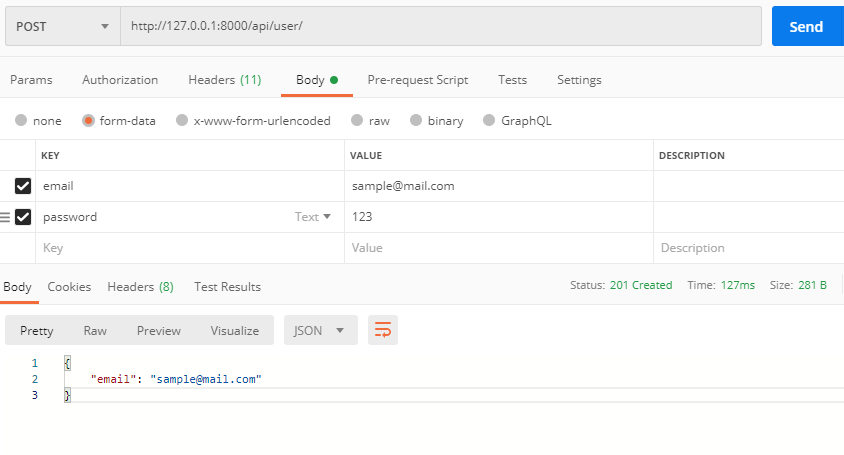
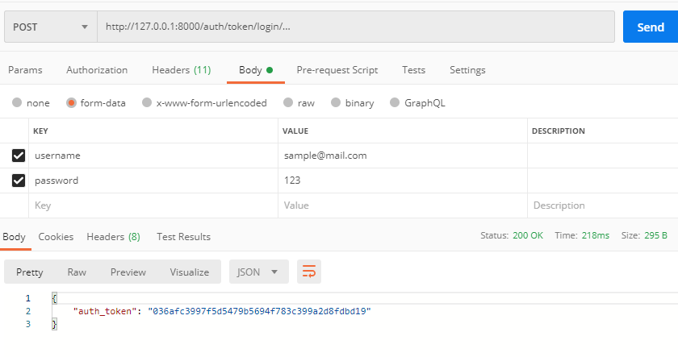
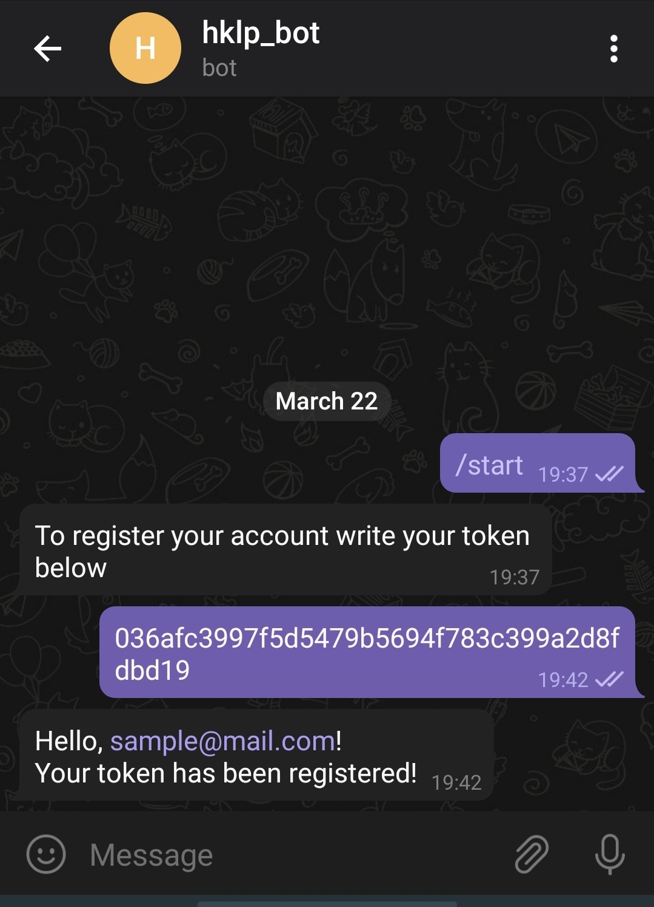
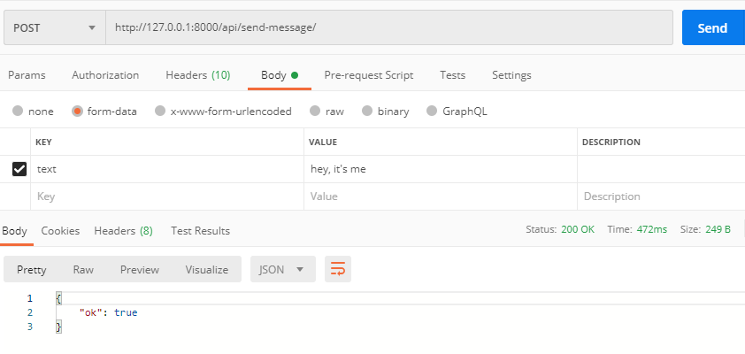
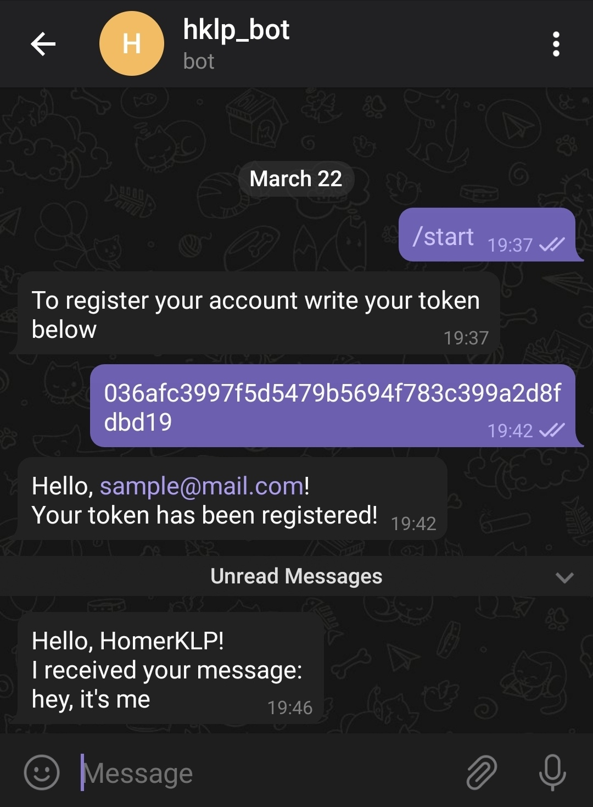

# factory_bot

### URLS:

FOR CREATING (POST) AND LISTING (GET) USERS:

http://127.0.0.1:8000/api/user/

FOR LOGIN AND LOGOUT (POST):

http://127.0.0.1:8000/auth/token/login \
http://127.0.0.1:8000/auth/token/logout

FOR MESSAGE SENDING (POST) TO YOUR BOT:

http://127.0.0.1:8000/api/send-message/

### To register your account in telegram bot follow this steps:

1) Activate message handler in django with "manage.py tg_bot" 
2) Find @hklp_bot in telegram
3) Message /start
4) Place your auth token, which you received from login page
5) After successful authorization you can send message to your bot via api

Sample:

